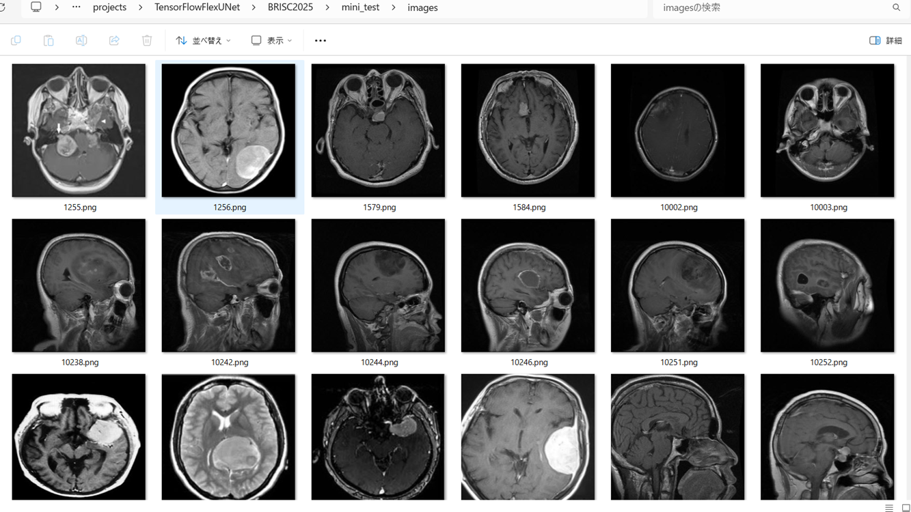

<h2>TensorFlow-FlexUNet-Image-Segmentation-BRISC2025-BrainTumor (2025/08/20)</h2>

This is the first experiment of Image Segmentation for BRISC2025 Multiclass, 
 based on our 
 <a href="https://github.com/sarah-antillia/TensorFlow-FlexUNet-Image-Segmentation-Model">
<b>TensorFlowFlexUNet (TensorFlow Flexible UNet Image Segmentation Model for Multiclass)</b></a>
, and a 512x512 pixels 
<a href="https://drive.google.com/file/d/1DabRhMkN7uwyxQUBzo6vF8Y4lSFCVOGn/view?usp=sharing">
<b>BRISC2025-PNG-ImageMask-Dataset.zip</b></a> with colorized 
masks (meningioma:blue, glioma:green, pituitary tumor:red).
which was derived by us from 
<a href="https://www.kaggle.com/datasets/briscdataset/brisc2025/data">
<b>BRISC 2025: Brain Tumor MRI Dataset for Segmentation and Classification</b></a>
</a>
 
 
<b>Acutual Image Segmentation for 512x512 BRISC2025 images</b> 

As shown below, the inferred masks predicted by our segmentation model trained on the 
PNG dataset appear similar to the ground truth masks. 
<b>rgb_map (meningioma:blue, glioma:green, pituitary tumor:red )</b>
 
<table>
<tr>
<th>Input: image</th>
<th>Mask (ground_truth)</th>
<th>Prediction: inferred_mask</th>
</tr>
<tr>
<td></td>
<td></td>
<td></td>
</tr>
<tr>
<td></td>
<td></td>
<td></td>
</tr>
<tr>
<td></td>
<td></td>
<td></td>
</tr>
</table>

 
<h3>1. Dataset Citation</h3>
The image and mask dataset used here has been taken from the following website. 
<a href="https://www.kaggle.com/datasets/briscdataset/brisc2025/data">
<b>BRISC 2025: Brain Tumor MRI Dataset for Segmentation and Classification</b>
</a>
 
 
<b>About Dataset</b> 
BRISC 2025: Brain Tumor MRI Dataset for Segmentation and Classification 
Arxiv link: https://arxiv.org/abs/2506.14318 

 
BRISC is a high-quality, expert-annotated MRI dataset curated for brain tumor segmentation and classification. 
It addresses common limitations in existing datasets (e.g., BraTS, Figshare), 
including class imbalance, narrow tumor focus, and annotation inconsistencies.
 
 
<b>Citation & Publication</b> 
This dataset is introduced in our publication: 
"BRISC: Annotated Dataset for Brain Tumor Segmentation and Classification with Swin-HAFNet" Fateh et al., 2025
 
 
If you use the BRISC dataset in your research, please cite our paper: 

BibTeX 
@article{fateh2025brisc, 
  title={BRISC: Annotated Dataset for Brain Tumor Segmentation and Classification with Swin-HAFNet}, 
  author={Fateh, Amirreza and Rezvani, Yasin and Moayedi, Sara and Rezvani, Sadjad and Fateh, Fatemeh and Fateh, Mansoor}, 
  journal={arXiv preprint arXiv:2506.14318}, 
  year={2025} 
} 
 
<b>License</b>: 
Attribution 4.0 International (CC BY 4.0)
 
 

<h3>
<a id="2">
2 BRISC2025 ImageMask Dataset
</a>
</h3>
 If you would like to train this BRISC2025 Segmentation model by yourself,
 please download the dataset from the google drive  
<a href="https://drive.google.com/file/d/1DabRhMkN7uwyxQUBzo6vF8Y4lSFCVOGn/view?usp=sharing">
BRISC2025-PNG-ImageMask-Dataset</a>.
 
, expand the downloaded ImageMaskDataset and put it under <b>./dataset</b> folder to be
<pre>
./dataset
└─BRISC2025
    ├─test
    │   ├─images
    │   └─masks
    ├─train
    │   ├─images
    │   └─masks
    └─valid
        ├─images
        └─masks
</pre>
 
 
<b>BRISC2025 Statistics</b> 
 
 

As shown above, the number of images of train and valid datasets is large enough to use for a training set of our segmentation model.
 
 
<b>Train_images_sample</b> 

 
<b>Train_masks_sample</b> 

 
<h3>
3 Train TensorFlowFlexUNet Model
</h3>
 We trained BRISC2025 TensorFlowFlexUNet Model by using the following
<a href="./projects/TensorFlowFlexUNet/BRISC2025/train_eval_infer.config"> <b>train_eval_infer.config</b></a> file.  
Please move to ./projects/TensorFlowFlexUNet/BRISC2025 and run the following bat file. 
<pre>
>1.train.bat
</pre>
, which simply runs the following command. 
<pre>
>python ../../../src/TensorFlowFlexUNetTrainer.py ./train_eval_infer.config
</pre>

<b>Model parameters</b> 
Defined a small <b>base_filters = 16 </b> and large <b>base_kernels = (9,9)</b> for the first Conv Layer of Encoder Block of 
<a href="./src/TensorFlowFlexUNet.py">TensorFlowFlexUNet.py</a> 
and a large num_layers (including a bridge between Encoder and Decoder Blocks).
<pre>
[model]
;You may specify your own UNet class derived from our TensorFlowFlexModel
model         = "TensorFlowFlexUNet"
generator     =  False
image_width    = 512
image_height   = 512
image_channels = 3
num_classes    = 4

base_filters   = 16
base_kernels   = (9,9)
num_layers     = 8
dropout_rate   = 0.05
dilation       = (3,3)
</pre>
<b>Learning rate</b> 
Defined a very small learning rate.  
<pre>
[model]
learning_rate  = 0.00005
</pre>
<b>Loss and metrics functions</b> 
Specified "categorical_crossentropy" and <a href="./src/dice_coef_multiclass.py">"dice_coef_multiclass"</a>. 
<pre>
[model]
loss           = "categorical_crossentropy"
metrics        = ["dice_coef_multiclass"]
</pre>
<b>Dataset class</b> 
Specifed <a href="./src/ImageCategorizedMaskDataset.py">ImageCategorizedMaskDataset</a> class. 
<pre>
[dataset]
class_name    = "ImageCategorizedMaskDataset"
</pre>
 
<b>Learning rate reducer callback</b> 
Enabled learing_rate_reducer callback, and a small reducer_patience.
<pre> 
[train]
learning_rate_reducer = True
reducer_factor     = 0.5
reducer_patience   = 4
</pre>
<b>Early stopping callback</b> 
Enabled early stopping callback with patience parameter.
<pre>
[train]
patience      = 10
</pre>

<b>RGB Color map</b> 
rgb color map dict for BRISC2025 1+3 classes. 
<pre>
[mask]
mask_file_format = ".png"
;background;black,  meningioma:blue, glioma:green, pituitary tumor:red
; rgb_map = {(0, 0, 0), (0,0,255):1,    (0,255,0):2,   (255, 0, 0):3}

</pre>

<b>Epoch change inference callback</b> 
Enabled <a href="./src/EpochChangeInferencer.py">epoch_change_infer callback (EpochChangeInferencer.py)</a></b>. 
<pre>
[train]
epoch_change_infer       = True
epoch_change_infer_dir   =  "./epoch_change_infer"
num_infer_images         = 6
</pre>

By using this callback, on every epoch_change, the inference procedure can be called
 for 6 images in <b>mini_test</b> folder. This will help you confirm how the predicted mask changes 
 at each epoch during your training process.    
As shown below, early in the model training, the predicted masks from our UNet segmentation model showed 
discouraging results.
 However, as training progressed through the epochs, the predictions gradually improved. 
  
<b>Il faut de la patience.</b>
  
  
 
<b>Epoch_change_inference output at starting (epoch 1,2,3)</b> 
 
 
<b>Epoch_change_inference output at middlepoint (epoch 18,19,20)</b> 
 
 
<b>Epoch_change_inference output at ending (epoch 38,39,40)</b> 
 
 
In this experiment, the training process was terminated at epoch 40.  
 
 

<a href="./projects/TensorFlowFlexUNet/BRISC2025/eval/train_metrics.csv">train_metrics.csv</a> 
 

 
<a href="./projects/TensorFlowFlexUNet/BRISC2025/eval/train_losses.csv">train_losses.csv</a> 
 

 

<h3>
4 Evaluation
</h3>
Please move to <b>./projects/TensorFlowFlexUNet/BRISC2025</b> folder, 
and run the following bat file to evaluate TensorFlowFlexUNet model for BRISC2025. 
<pre>
./2.evaluate.bat
</pre>
This bat file simply runs the following command.
<pre>
python ../../../src/TensorFlowFlexUNetEvaluator.py ./train_eval_infer_aug.config
</pre>

Evaluation console output: 

  

<a href="./projects/TensorFlowFlexUNet/BRISC2025/evaluation.csv">evaluation.csv</a> 
The loss (categorical_crossentropy) to this BRISC2025/test was low and dice_coef_multiclass 
high as shown below.
 
<pre>
categorical_crossentropy,0.016
dice_coef_multiclass,0.993
</pre>
 

<h3>
5 Inference
</h3>
Please move <b>./projects/TensorFlowFlexUNet/BRISC2025</b> folder 
,and run the following bat file to infer segmentation regions for images by the Trained-TensorFlowFlexUNet model for BRISC2025. 
<pre>
./3.infer.bat
</pre>
This simply runs the following command.
<pre>
python ../../../src/TensorFlowFlexUNetInferencer.py ./train_eval_infer_aug.config
</pre>

<b>mini_test_images</b> 
 
<b>mini_test_mask(ground_truth)</b> 
 

<b>Inferred test masks</b> 
 
 

<b>Enlarged images and masks of 512x512 pixels</b> 
<table>
<tr>
<th>Image</th>
<th>Mask (ground_truth)</th>
<th>Inferred-mask</th>
</tr>
<b>rgb_map (meningioma:blue, glioma:green, pituitary tumor:red )</b> 
<tr>
<td></td>
<td></td>
<td></td>
</tr>

<tr>
<td></td>
<td></td>
<td></td>
</tr>

<tr>
<td></td>
<td></td>
<td></td>
</tr>

<tr>
<td></td>
<td></td>
<td></td>
</tr>

<tr>
<td></td>
<td></td>
<td></td>
</tr>

<tr>
<td></td>
<td></td>
<td></td>
</tr>
</table>

 
<h3>
References
</h3>
<b>1. BRISC 2025: Brain Tumor MRI Dataset for Segmentation and Classification</b> 
<a href="https://www.kaggle.com/datasets/briscdataset/brisc2025/data">
https://www.kaggle.com/datasets/briscdataset/brisc2025/data
</a>
 
 
<b>2. BRISC: Annotated Dataset for Brain Tumor Segmentation and Classification with Swin-HAFNet</b> 
Amirreza Fateha, Yasin Rezvanib, Sara Moayedib, Sadjad Rezvani, Fatemeh Fatehc, Mansoor Fatehb 
<a href="https://arxiv.org/pdf/2506.14318v1">https://arxiv.org/pdf/2506.14318v1
</a>
 
 

<b>3. TensorFlow-FlexUNet-Image-Segmentation-Figshare-BrainTumor </b> 
Toshiyuki Arai @antillia.com 
<a href="https://github.com/sarah-antillia/TensorFlow-FlexUNet-Image-Segmentation-Figshare-BrainTumor">
https://github.com/sarah-antillia/TensorFlow-FlexUNet-Image-Segmentation-Figshare-BrainTumor
</a>
 
 
